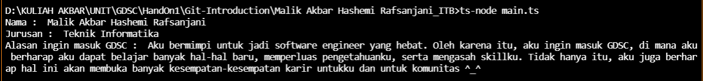

# Identitas Diri

## Output (Text)

```
Nama : Malik Akbar Hashemi Rafsanjani
Jurusan : Teknik Informatika
Alasan ingin masuk GDSC : Aku bermimpi untuk jadi software engineer yang hebat. Oleh karena itu, aku ingin masuk GDSC, di mana aku berharap aku dapat belajar banyak hal-hal baru, memperluas pengetahuanku, serta mengasah skillku. Tidak hanya itu, aku juga berharap hal ini akan membuka banyak kesempatan-kesempatan karir untukku dan untuk komunitas ^_^ 
```

## Output (Image)

